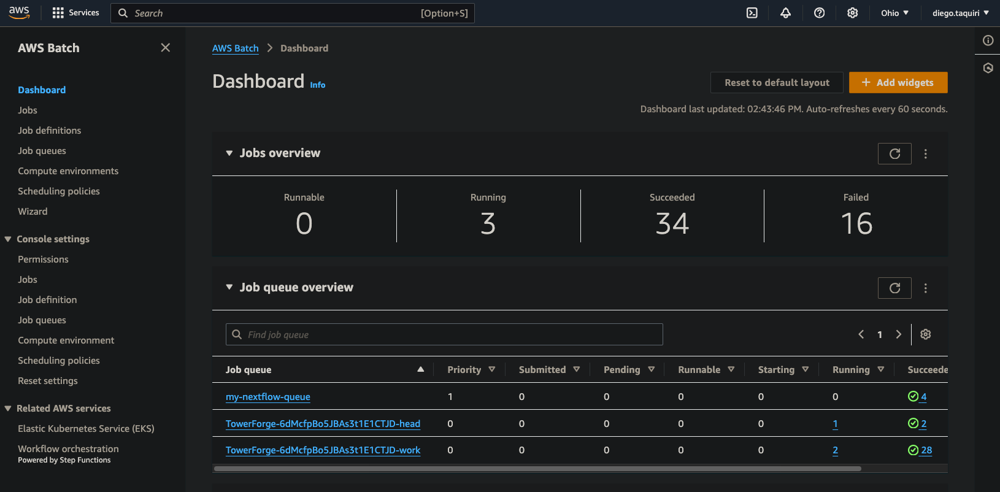
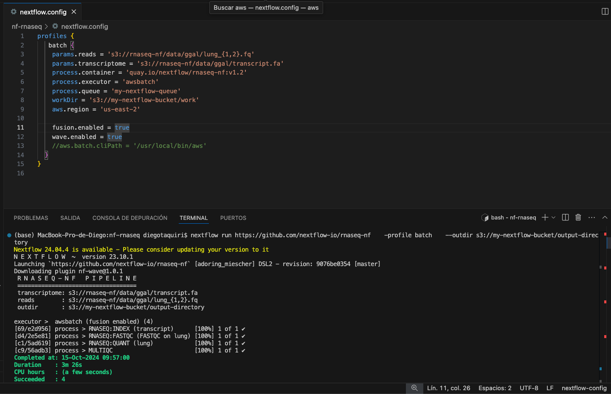

# AWS-scRNAseq-Nextflow
# Bioinformatics Pipelines with AWS Cloud Infrastructure

This repository contains two bioinformatics analysis pipelines I deployed using AWS cloud resources. These projects consist of single-cell RNA sequencing (scRNA-seq) and RNA sequencing (RNA-seq) pipelines. Below is a summary of the two pipelines, the infrastructure setup, and the tools I used.

## Pipeline 1: Single-cell RNA Sequencing with Nextflow & AWS Batch

I ran the nf-core/scrnaseq pipeline using Nextflow and AWS Batch. This pipeline is designed to process 10X Genomics single-cell RNA-seq data. 

Here is an overview of the AWS dashboard used to monitor and manage the pipeline:

For this project, I:

### Pipeline Execution
- Used the Nextflow Tower to manage and monitor the pipeline execution.
- The main steps included quantifying the expression using salmon alevin to generate expression matrices, which is ideal for quantifying transcripts in single-cell RNA-seq.

### Cloud Infrastructure
- I set up the AWS Batch infrastructure, which involved creating an S3 bucket for storing intermediate pipeline files, logs, and results, as well as configuring the compute environment, job queue, and job definitions in AWS Batch.

### AWS Services Used
This pipeline utilized several AWS services, including:

- **S3 Storage**: Used to store the input data, intermediate files, and final results.
- **AWS Batch**: Managed the compute environment to run the pipeline efficiently.
- **IAM Roles**: Configured IAM roles with appropriate permissions for AWS Batch and S3 interactions.

## Pipeline 2: RNA-seq Pipeline Using Nextflow

The second pipeline involved running the Nextflow RNA-seq pipeline to analyze bulk RNA sequencing data. Unlike the first project, I executed this pipeline directly from the command line without Nextflow Tower.

Below is an example of the AWS CLI configuration used in the pipeline setup:

### Pipeline Execution
- I set up the configuration file (`nextflow.config`) to link the required AWS resources and executed the pipeline via the command line in Visual Studio Code.
- This involved specifying parameters such as the input files, reference transcriptome, and output directories, all of which were stored in S3.

### AWS Integration
This pipeline was configured to communicate directly with my AWS account:

- **AWS CLI Configuration**: I ensured Nextflow could communicate with AWS Batch and S3 for data storage and compute.
- **S3 Storage**: Used S3 for input files, intermediate files, and output storage, similar to the first pipeline.
- **IAM Policies**: Configured the appropriate IAM policies to grant Nextflow access to AWS Batch and S3.
